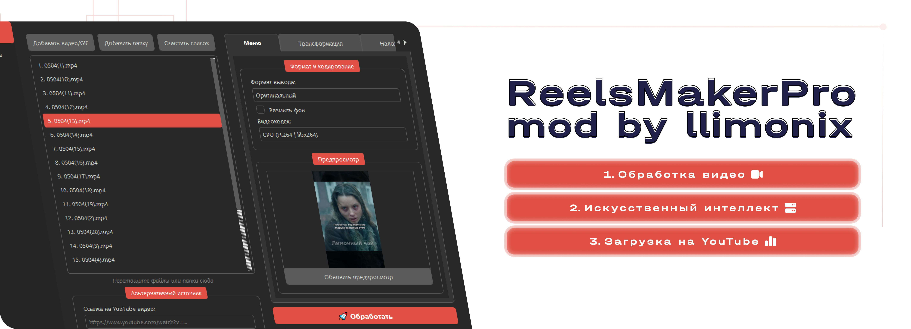

# ReelsMaker Pro



## Описание

ReelsMaker Pro — это мощное приложение для обработки видео с возможностью загрузки на YouTube и использованием искусственного интеллекта для автоматической генерации метаданных.

## Функциональность

### 🎬 Обработка видео
- **Применение фильтров**: черно-белое, сепия, инверсия, размытие, пикселизация, VHS эффекты
- **Управление цветом**: настройка яркости, контрастности, насыщенности
- **Трансформации**: отражение по горизонтали/вертикали, масштабирование, обрезка
- **Оверлеи**: наложение изображений и GIF-анимации с настройкой позиции
- **Обработка скорости**: ускорение/замедление видео с динамическими и статическими режимами
- **Зум эффекты**: приближение/отдаление с различными режимами
- **Форматы**: конвертация в различные форматы, включая специальный формат Reels/TikTok (1080x1920)
- **Аудио**: отключение звука, наложение аудиодорожек, настройка громкости
- **Субтитры**: добавление субтитров из SRT файлов или автогенерация через Whisper

### 📱 Специальные форматы
- **Reels/TikTok формат**: автоматическое изменение размера под вертикальный формат
- **Размытый фон**: опция размытия фона для лучшего вписывания в вертикальный формат
- **Автообрезка**: интеллектуальное определение областей обрезки

### 🤖 Искусственный интеллект
- **Автогенерация метаданных**: создание заголовков, описаний и тегов на основе содержимого видео
- **Распознавание речи**: использование Whisper для извлечения текста из аудио
- **Умная обработка**: анализ видео для оптимальной обработки

### 📺 Загрузка на YouTube
- **Прямая загрузка**: интеграция с YouTube API для загрузки обработанных видео
- **Настройка приватности**: публичные, частные видео и по расписанию
- **Автозаполнение**: использование ИИ для генерации метаданных YouTube
- **Мониторинг прогресса**: отслеживание процесса загрузки в реальном времени

### 🔧 Дополнительные возможности
- **Пакетная обработка**: обработка множества файлов одновременно
- **Предпросмотр**: генерация превью обработанного видео
- **Загрузка с YouTube**: скачивание видео по ссылке для дальнейшей обработки
- **Удаление метаданных**: очистка файлов от EXIF и других метаданных

## Системные требования

### Обязательные зависимости

Для корректной работы приложения необходимо установить следующие программы и добавить их в PATH:

#### 1. FFmpeg и FFprobe
1. Скачайте FFmpeg с официального сайта: https://ffmpeg.org/download.html
2. Распакуйте архив в `C:\ffmpeg\`
3. Добавьте `C:\ffmpeg\bin` в переменную PATH:
   - Откройте "Панель управления" → "Система" → "Дополнительные параметры системы"
   - Нажмите "Переменные среды"
   - В разделе "Системные переменные" найдите "Path" и нажмите "Изменить"
   - Добавьте новый путь: `C:\ffmpeg\bin`
   - Нажмите "ОК" для сохранения

#### 2. yt-dlp
1. Скачайте yt-dlp с GitHub: https://github.com/yt-dlp/yt-dlp/releases
2. Создайте папку `C:\yt-dlp\bin\`
3. Поместите файл `yt-dlp.exe` в эту папку
4. Добавьте `C:\yt-dlp\bin` в переменную PATH (аналогично FFmpeg)

#### Проверка установки
Откройте командную строку и выполните:
```bash
ffmpeg -version
ffprobe -version
yt-dlp --version
```

Все команды должны вывести информацию о версии.

## Установка и запуск из исходного кода

### 1. Клонирование репозитория
```bash
git clone https://github.com/nellimonix/ReelsMakerPro.git
cd ReelsMakerPro
```

### 2. Создание виртуального окружения
```bash
python -m venv venv
```

### 3. Активация виртуального окружения
**Windows:**
```bash
venv\Scripts\activate
```

**macOS/Linux:**
```bash
source venv/bin/activate
```

### 4. Установка зависимостей
```bash
pip install -r requirements.txt
```

### 5. Запуск приложения
```bash
python main.py
```

## Настройка загрузки на YouTube

Для настройки загрузки видео на YouTube необходимо настроить API доступ. Подробная инструкция доступна по ссылке:

**[Инструкция по настройке YouTube API](instruction.md)**

## Компиляция в EXE файл

### Установка PyInstaller
```bash
pip install pyinstaller
```

### Базовая компиляция
```bash
pyinstaller --onefile --windowed --icon=resources/icon.ico main.py
```

### Компиляция с встроенными зависимостями

Для создания полностью независимого EXE файла с встроенными FFmpeg, FFprobe и yt-dlp:

1. Создайте папку `bin` в корне проекта
2. Скопируйте в неё файлы:
   - `ffmpeg.exe`
   - `ffprobe.exe`
   - `yt-dlp.exe`

3. Выполните компиляцию с дополнительными данными:
```bash
pyinstaller --onefile --windowed --icon=resources/icon.ico --add-data "bin;bin" --add-data "resources;resources" main.py
```

### Дополнительные опции компиляции
Для оптимизации размера и производительности:
```bash
pyinstaller --onefile --windowed --icon=resources/icon.ico --add-data "bin;bin" --add-data "resources;resources" --optimize=2 --strip main.py
```

После компиляции EXE файл будет находиться в папке `dist/`.

## Лицензия

Этот проект распространяется под лицензией MIT. Подробности см. в файле [LICENSE](LICENSE).

## Поддержка

Если у вас возникли вопросы или проблемы, создайте [Issue](https://github.com/nellimonix/ReelsMakerPro/issues) в этом репозитории.

---